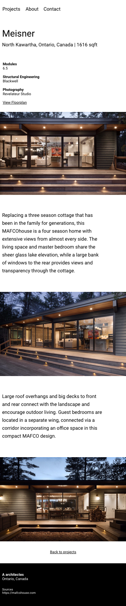

# Intégration de maquette mobile - Architecture

Intégrez la maquette de la façon la plus précise possible.

Les éléments nécessaires à l'intégration se trouvent dans le dossier **\_consigne**.

Utilisez la **maquette Figma** pour récupérer les bonnes informations (par exemple typographie et marges).

